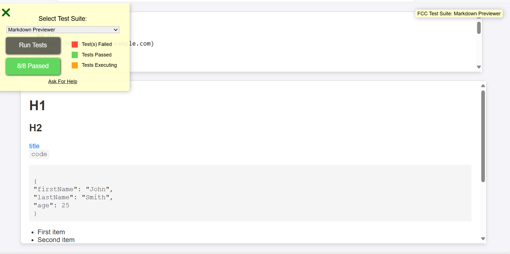

# Markdown machine🚀

## Project Description 📝

Hi guys welcome to my thired react app. i make this project because of implementing HTML CSS and js as jsx components in thus html and js in root component of app.js and so on and it was so interesting this was new thing for me i never do that before, show my activity that how much i work on it and what i achive from this.
this website contains idea about how creating random machine.


```REACT
return (
    <div className="App">
      <textarea id="editor" onChange={(event) => {setText(event.target.value);

      }}
      value={text}
      ></textarea>
      <div id="preview" dangerouslySetInnerHTML={{
        __html: marked(text),
      }}></div>
    </div>
  );
```

## Demo 📸
life demo link []



## Technologies Used 🛠️
- HTML
- CSS
- REACT JS

## Installation 💻

```clone
https://github.com/sodabarauf/markdown-previewer.git
```
## Features ⭐
- This website is a responsive website for mobile and desktop version. 

## Author 👩‍💼
Sodaba✨Rauf✨
- Github: [https://github.com/sodabarauf]✔
- LinkedIn: [https://www.linkedin.com/in/sodaba-r-5a0733255/]✔
- Email: [sodabarauf4@gmail.com]✔

## Contributing 🤝
🎇 by using this link you can share your opinion : [https://github.com/sodabarauf/markdown-previewer.git]
